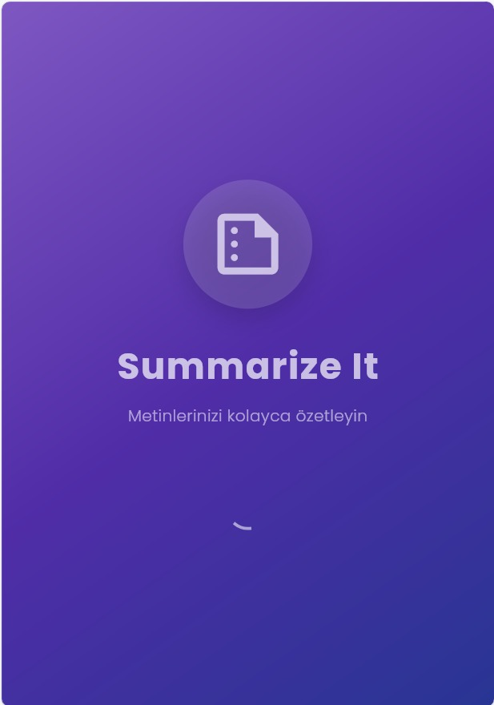
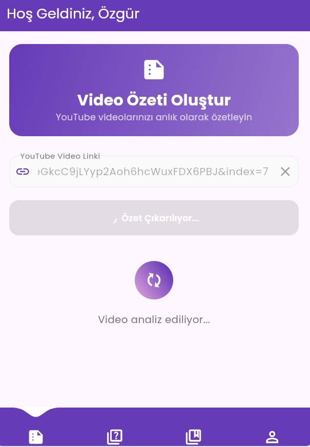
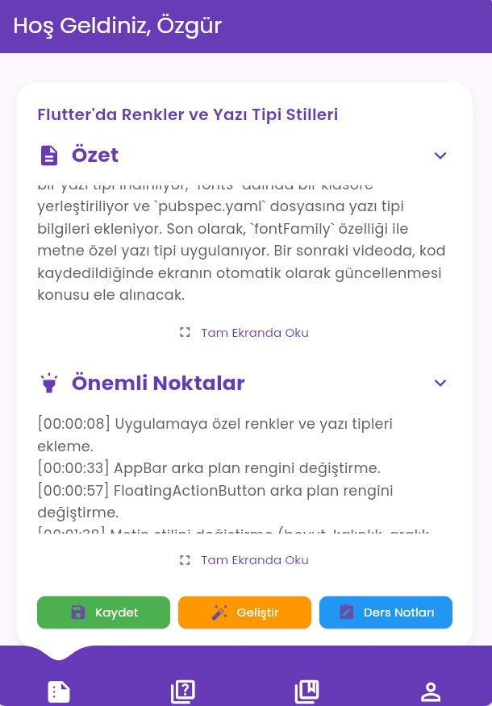
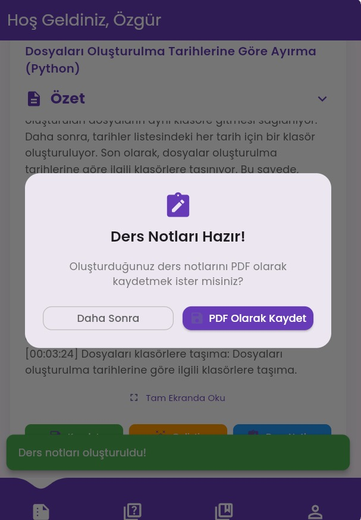

# 🎥 Summarize It

**Summarize It**, YouTube videolarını analiz ederek içeriklerini özetleyen bir mobil uygulamadır.  
Flutter ile geliştirilen bu uygulama, FastAPI tabanlı bir backend'e bağlanarak Google Gemini API üzerinden video transkriptini işler, başlık ve özet üretir.

---

## 🚀 Özellikler

- 🔗 YouTube video linki ile otomatik özet alma
- ✍️ Gemini AI ile içerik analizi ve Türkçe başlık + özet oluşturma
- 📄 Oluşturulan özeti cihazınıza PDF olarak kaydedebilme
- 🧠 Özet üzerinden quiz oluşturma ve çözüm geçmişi takibi
- 🎓 Video içeriğini ders notu formatında görselleştirme
- 📊 Quiz sonucunu gösterme ve tekrar çözüm opsiyonu
- 📱 Flutter ile modern, sezgisel ve kullanıcı dostu arayüz

---

## 🧰 Kullanılan Teknolojiler

| Katman        | Teknoloji                     |
| ------------- | ----------------------------- |
| 🎯 Mobil      | Flutter (Dart)                |
| ⚙️ Backend    | FastAPI (Python)              |
| 🧠 Yapay Zeka | Google Gemini (Generative AI) |
| 🔠 NLP        | youtube-transcript-api        |
| 🔒 Ortam      | python-dotenv                 |

---

## 📱 Uygulama Görselleri

### Ana Ekran – Video Özetleme



### Video Özetleme



### Önemli Noktalar



### Quiz Listesi


### Ders Notu Oluşturma ve PDF Kaydetme



---

## 🧪 Nasıl Çalışır?

1. Kullanıcı bir YouTube video linki girer.
2. Flutter uygulaması bu linki backend'e gönderir (`/summarize` endpoint).
3. Backend, videonun transkriptini çeker ve Gemini ile:
   - Kısa bir başlık (10 kelimeyi geçmeyen)
   - Maksimum 250 kelimelik Türkçe özet üretir.
4. Sonuçlar Flutter arayüzünde kullanıcıya gösterilir.

---

## 📦 Kurulum

### ✅ Backend (FastAPI)

1. Depoyu klonlayın:
   ```bash
   git clone https://github.com/iremdilsatkse/summarize-it.git
   cd summarize-it
   ```
2. Sanal ortam oluşturun ve etkinleştirin:

   ```bash
   python -m venv venv
   source venv/bin/activate  # Windows: venv\Scripts\activate
   ```

3. Gereken Python paketlerini yükleyin:

   ```bash
   pip install -r requirements.txt
   ```

4. Ortam değişkenlerini tanımlayın:

.env.example dosyası örnek ortam dosyasıdır. Kendi .env dosyanızı şu şekilde oluşturun:

```bash
cp .env.example .env # Windows: copy .env.example .env
```

Ardından .env dosyasını açın ve Gemini API anahtarınızı girin:

```bash
GEMINI_API_KEY=your_gemini_api_key_here
```

⚠️ .env dosyası .gitignore içinde yer alır ve Git'e eklenmez. Bu sayede gizliliğiniz korunur.

5. Uygulamayı başlatın:

   ```bash
   uvicorn main:app --reload
   ```

   API dokümantasyonu: http://localhost:8000/docs
